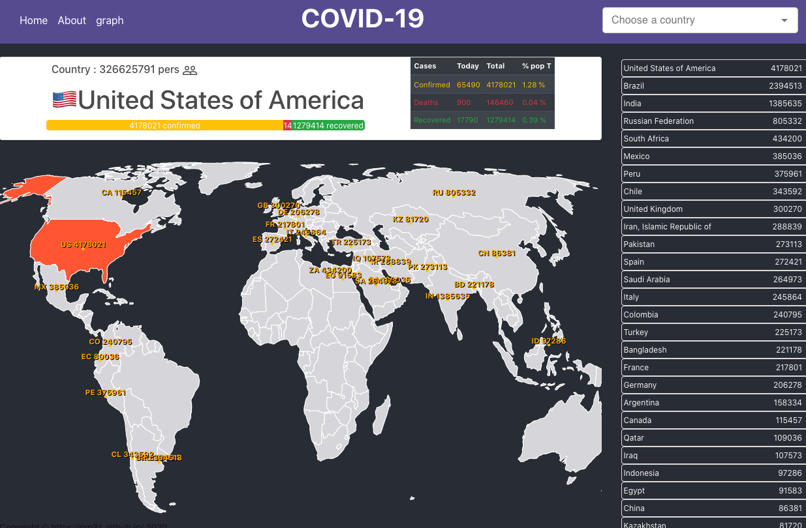
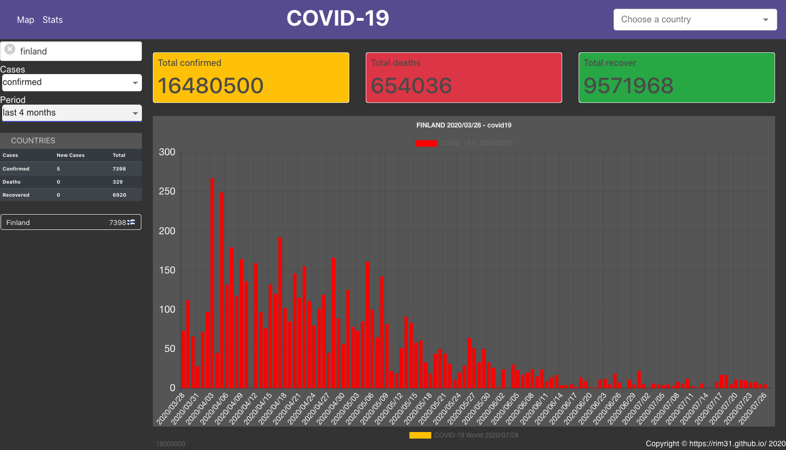

# my COVID-19 Tracker : https://rim31.github.io/covid19/






Data Source : 

source : "https://api.covid19api.com/"

source : "https://covidtracking.com/api/us/daily"

<!> Warning : one Api source doesn't work on Opera Browser

## Explanation :

1.  search a country on a world map
  - info about people, infected, deaths and recovered people from coronavirus Covid19
2.  Statistics:
  - instant search :  display a country among 247, display a graph of the evolution of coronavirus in every country
  - weeks, months and beginning 01/2020

## Technos : 

Mac OX, React js, typescript, unstated(other redux)
   - react: ^16.13.1,
   - typescript: ^3.9.6,
   - react-simple-maps: ^2.1.2,
   - unstated-next: ^1.1.0,
   - react-chartjs-2: ^2.9.0,


## package.json

Run : 
```
git clone ...
cd ...
```

```
yarn dev
```

Installation new project : 
```
yarn create react-app my-app --template typescript

yarn add typescript @types/node @types/react @types/react-dom @types/jest

yarn add unstated-next
yarn add react-router-dom
yarn add typescript @types/react-router-dom
yarn add react-bootstrap bootstrap
yarn add nodemon
yarn add react-chartjs-2 chart.js
yarn add @material-ui/core
```

## CSS style

Style : Bootstrap + Material UI + Bulma

### others 


| techno           | version |
| ---------------- |:-------:|
|bootstrap         | ^4.5.0  |
|chart.js          | ^2.9.3  |
|d3                | ^5.16.0 |
|lodash            | ^4.17.19|
|moment            | ^2.27.0 |
|react             | ^16.13.1|
|react-chartjs-2   | ^2.9.0  |
|react-dom         | ^16.13.1|
|react-moment      | ^0.9.7  |
|react-router-dom  | ^5.2.0  |
|react-scripts     | 3.4.1   |
|react-simple-maps | ^2.1.2  |
|react-tooltip     | ^4.2.7  |
|typescript        | ^3.9.6  |
|unstated-next     | ^1.1.0  |
|material-ui/core  | ^4.11.0 |
|jest              | ^26.0.4 |

## structure

```
src
├── App.css
├── App.test.tsx
├── App.tsx
├── components
│   ├── Charts
│   │   ├── BarChart.tsx
│   │   ├── Dashboard.tsx
│   │   ├── LinearChart\ copy.tsx
│   │   ├── LinearChart.tsx
│   │   ├── SelectCase.tsx
│   │   └── SelectPeriod.tsx
│   ├── Countries.tsx
│   ├── Layout.tsx
│   ├── Map
│   │   ├── GeoChart.world.geo.json
│   │   ├── MapChart.tsx
│   │   └── map.geojson
│   ├── Pages
│   │   ├── AboutComponent.tsx
│   │   ├── GraphComponent\ copy.tsx
│   │   ├── GraphComponent.tsx
│   │   ├── HomeComponent\ copy.tsx
│   │   ├── HomeComponent.tsx
│   │   ├── MainComponent.tsx
│   │   └── MapComponent.tsx
│   ├── Store.tsx
│   └── modules
│       ├── Flag.js
│       ├── ListCountries.tsx
│       ├── SearchBar.tsx
│       ├── SortCountries.js
│       └── TableCasesData.tsx
├── index.css
├── index.tsx
├── logo.svg
├── react-app-env.d.ts
├── serviceWorker.ts
└── setupTests.ts
```

## MEMO of technos :

1. unstated : store / instead of redux 😎

1.1. creation of a Store
/Store.tsx
```
// eslint-disable-next-line
import * as React from 'react';
import { createContainer } from "unstated-next";
import moment from 'moment';

interface ICountryData {
  Cases: Number,
  City: String,
  CityCode: String,
  Country: String,
  CountryCode: String,
  Date: Date,
  Lat: String,
  Lon: String,
  Province: String,
  Status: String,
}

export const useStore = () => {
  const [covidApiCountries, setCovidApiCountries] = React.useState<Object[] | void | undefined>([]);

  let country_list = [
    { "name": "Afghanistan", "code": "AF" }, { ... },{ "name": "Zimbabwe", "code": "ZW" }
  ];

  function countryDataGraph(data: ICountryData[]) {
    let resultCases: any[] = []
    let resultDates: any[] = []
    if (data.length > 0) {
      data.map((item) => {
        resultCases.push(item.Cases);
        resultDates.push(moment(item.Date).format('YYYY/MM/DD'));
      })
      setData(resultCases);
      setLabels(resultDates);
    } else {
      setData([]);
      setLabels([]);
    }
  }


  function getCovidApiAll() {
    try {
      return fetch(`https://api.covid19api.com/summary`, {
        method: "GET",
      }).then((response: any) => response.json()).then((res) => {
        // console.log(res.countries);
        return (res);
      }).catch(err => alert(err));
    } catch (err) {
      console.log(err)
      return;
    }
  };


  const getCovidCountries = async () => {
    setCovidApiCountries(await getCovidApiAll());
  }

  React.useEffect(() => {
    console.log("unstated Store")
    // eslint-disable-next-lines
  }, [])

  return {
    country_list,
    covidApiCountries,
    getCovidCountries,
    countryDataGraph,
  };
}
export const StoreContainer = createContainer(useStore)

```


Add in App.tsx
```
import React from 'react';
import Layout from './components/Layout';
import HomeComponent from './components/Pages/HomeComponent';
import AboutComponent from './components/Pages/AboutComponent';
import GraphComponent from './components/Pages/GraphComponent';
import { StoreContainer } from "./components/Store" ///////////////// HERE ////////////////////
import { BrowserRouter as Router, Switch, Route } from 'react-router-dom';

function App() {

  return (
    <Router>
      <StoreContainer.Provider>///////////////// HERE ////////////////////
        <Layout>
          <Switch>
            <Route exact path={'/'} children={HomeComponent} />
            <Route exact path={'/about'} children={AboutComponent} />
            <Route exact path={'/graph/:country?'} component={GraphComponent} />
            <Route path={'*'} ><NotFound /></Route>
          </Switch>
        </Layout>
      </StoreContainer.Provider>///////////////// HERE ////////////////////
    </Router>
  );
}

function NotFound() {
  return (
    <h1>Page Not Found</h1>
  )
}

export default App;

```


use it in the component
HomeComponent.tsx
```
import * as React from 'react';
import { Link } from 'react-router-dom';
import { StoreContainer } from '../Store';


export default function HomeComponent() {
  const unstated = StoreContainer.useContainer();

  const [countries, setCountries] = useState<String[] | null>([])

  React.useEffect(() => {
  setCountries(unstated.country_list);
  eslint-disable-next-line
  }, [])

  return (
    <div>
      <h1>HOME</h1>
      <Link to="/about">About</Link>
      <Link to="/graph">Graph</Link>
      <div>
        {/* {countries ?
          countries.map((item, i) => <span key={i}>{item}</span>)
          : <span></span>
        } */}
      </div>
    </div>
  )
}

```


## react router 5

2. Router - Routing

2.1. creation of Routing
```
import React from 'react';
import Layout from './components/Layout';
import HomeComponent from './components/Pages/HomeComponent';
import AboutComponent from './components/Pages/AboutComponent';
import GraphComponent from './components/Pages/GraphComponent';
import { BrowserRouter as Router, Switch, Route } from 'react-router-dom';

function App() {
  return (
    <Router>
      <Layout>
        <Switch>
          <Route exact path={'/'} children={HomeComponent} />
          <Route exact path={'/about'} children={AboutComponent} />
          <Route exact path={'/graph/:country?'} component={GraphComponent} />
          <Route path={'*'} ><NotFound /></Route>
        </Switch>
      </Layout>
    </Router>
  );
}

function NotFound() {
  return (
    <h1>Page Not Found</h1>
  )
}

export default App;
```

2.1.1 Add link 
in components :
```
import React from 'react'
import { Link } from 'react-router-dom';

export default function AboutComponent() {
  return (
    <div>
      About
      <Link to="/home">home</Link>

    </div>
  )
}

```

2.1.2. params in URL

- useParams : read the end of URL
- useHistory : to go the top page
- useLocation : gives the current location

```
import React from 'react'
import { Link, useParams, useHistory } from 'react-router-dom';

export default function GraphComponent() {
  let { country } = useParams();
  let history = useHistory();
  return (
    <div>
      Graph
      <h1>{country}</h1>
      <Link to="/">home</Link>
      <Link to="/about">About</Link>
      <div className="button is-primary" onClick={() => history.push('/')}>Home</div>
    </div>
  )
}


```

example  : location

```
function usePageViews() {
  let location = useLocation()

  useEffect(
    () => {
      ga.send(['pageview', location.pathname])
    },
    [location]
  )
}

```
